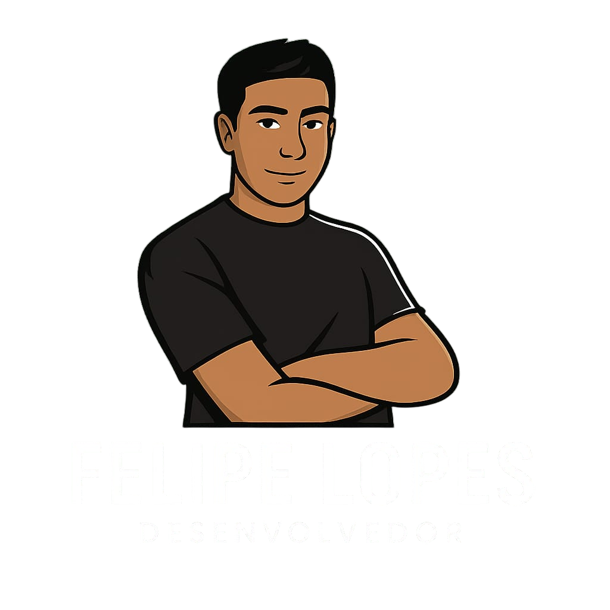

  
  <h1><strong>Portfólio Pessoal | Felipe Soeiro Lopes</strong></h1>
  
Um portfólio web moderno, responsivo e interativo, construído para apresentar minha trajetória, projetos e habilidades no universo da tecnologia.

  
  

    
    
  

---

## 🚀 Sobre o Projeto

Este projeto é a minha vitrine profissional digital. Foi desenvolvido do zero com foco em criar uma experiência de usuário fluida e um design elegante, que se adapta perfeitamente a qualquer dispositivo, seja mobile ou desktop. O objetivo é apresentar de forma clara e objetiva minhas competências, experiências profissionais e os projetos que desenvolvi.

## ✨ Recursos Implementados

O portfólio conta com diversas funcionalidades modernas para garantir uma navegação agradável e interativa:

- **🎨 Design Responsivo:** Layout 100% adaptável para uma visualização perfeita em celulares, tablets e desktops, com otimizações específicas para cada tamanho de tela.
- **📱 Menu Mobile Moderno:** Um menu lateral deslizante, com ícone animado (hambúrguer para "X"), que proporciona uma experiência de navegação intuitiva e sofisticada em dispositivos móveis.
- **🎠 Carrossel de Tecnologias:** Uma faixa com rolagem infinita e interativa para apresentar as tecnologias que domino de forma dinâmica.
- **⚡ Animações GSAP:** Animações profissionais e fluidas implementadas com GSAP (GreenSock Animation Platform) e ScrollTrigger, criando uma experiência visual moderna e envolvente em todas as páginas.
- **✨ Animações de Scroll:** Elementos aparecem suavemente conforme o usuário rola a página, criando uma experiência dinâmica e interativa.
- **💫 Avatar Animado:** Avatar com animação de pulsação contínua, alternando entre estados forte e fraco, criando um efeito visual atrativo.
- **🎭 Seção de Depoimentos Redesenhada:** Layout limpo e monocromático com avaliação em estrelas, avatares com iniciais em gradiente, nome e cargo do autor e brilho sutil no hover. O primeiro depoimento aparece em destaque (linha inteira) no desktop, e os demais ficam em cards compactos cuja altura se ajusta ao tamanho de cada mensagem. Inclui recomendações reais de líderes, mentores e professores.
- **💼 Galeria de Projetos Repaginada:** Cards com imagem em destaque, etiqueta de categoria, número do projeto, botão "Ver Projeto" com seta animada e ícones de stack apresentados em tiles elegantes.
- **👾 Easter Egg:** Um segredo escondido para os curiosos. Será que você consegue encontrar? (Dica: tente clicar na logo principal algumas vezes).
- **🔼 Botão "Voltar ao Topo":** Facilita a navegação em páginas mais longas.
- **📊 Estatísticas Animadas:** Números que ganham vida com animação de contagem e destacam minhas conquistas de forma visual.
- **🎯 Hover Effects Interativos:** Efeitos de hover suaves em todos os elementos interativos, melhorando o feedback visual.
- **🔥 Efeitos Visuais Avançados:** Filtros CSS para realçar imagens, sombras com glow, bordas animadas e gradientes modernos.
- **🧭 Home com Respiro entre as Telas:** As estatísticas viram um card centralizado e a faixa de tecnologias ganha moldura própria, criando separação clara entre as seções. No celular o "scroll snap" rígido foi desativado, permitindo rolagem natural com seções de altura adaptável e espaçamento real entre elas.
- **📐 Responsividade Refinada:** Botões do hero centralizados e com largura uniforme no mobile, e-mail de contato que quebra linha em vez de cortar em telas pequenas, e ajustes finos de espaçamento e tipografia em todos os breakpoints.

## 🛠️ Tecnologias Utilizadas

O projeto foi construído utilizando as seguintes tecnologias:

- **HTML5:** Para a estruturação semântica e acessível do conteúdo.
- **CSS3:** Para toda a estilização, animações e a criação dos layouts responsivos, utilizando recursos modernos como Flexbox, Grid, a função `clamp()`, animações keyframes e filtros avançados.
- **JavaScript (ES6+):** Para adicionar interatividade, manipular o DOM e implementar funcionalidades dinâmicas como o menu mobile, animações de scroll e o Easter Egg.
- **GSAP (GreenSock Animation Platform):** Biblioteca profissional de animações JavaScript para criar efeitos suaves e performáticos.
- **ScrollTrigger:** Plugin do GSAP para animações baseadas em scroll, proporcionando uma experiência visual dinâmica.

## 🗺️ Estrutura do Site

- **`index.html`**: A página inicial, com apresentação animada, estatísticas, carrossel de tecnologias e chamada para os depoimentos, com seções espaçadas e animações GSAP.
- **`projetos.html`**: Uma galeria repaginada com os meus principais projetos, incluindo links para os repositórios, animações de entrada e hover effects.
- **`formacoes.html`**: Minhas formações acadêmicas e certificações, com os logos das instituições.
- **`experiencia.html`**: Detalhes sobre a minha trajetória profissional, com cards animados e layout totalmente responsivo para mobile.
- **`depoimentos.html`**: Recomendações de líderes, mentores e professores, em cards com avaliação por estrelas e um depoimento em destaque.
- **`contato.html`**: Informações e links para contato, com cards interativos e animações suaves.
- **`easteregg.html`**: A página secreta!
- **`styles.css`**: A folha de estilos central que define todo o design do site, incluindo animações CSS, media queries responsivas e efeitos visuais modernos.
- **`script.js`**: Onde toda a mágica da interatividade acontece, incluindo o menu mobile e funcionalidades JavaScript.

## 👨‍💻 Autor

Feito com ❤️ por **Felipe Soeiro Lopes**.

  
  

